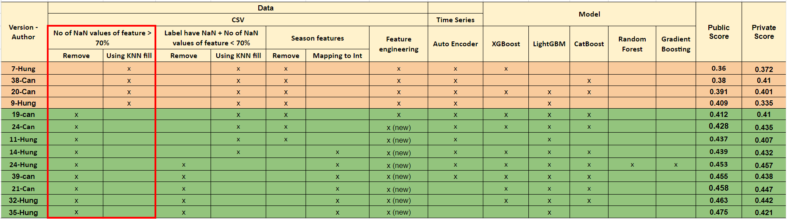
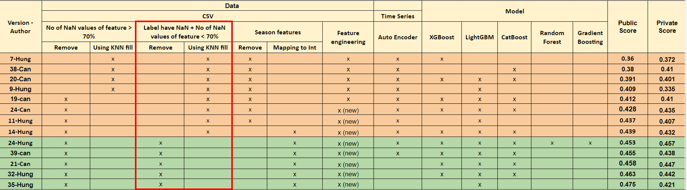
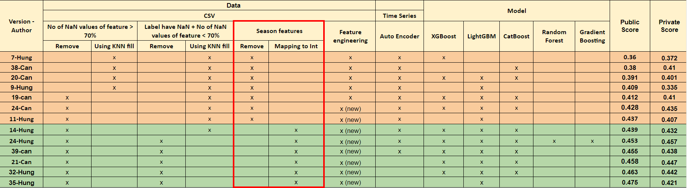
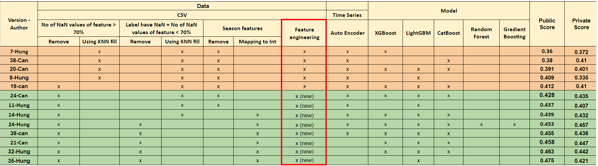
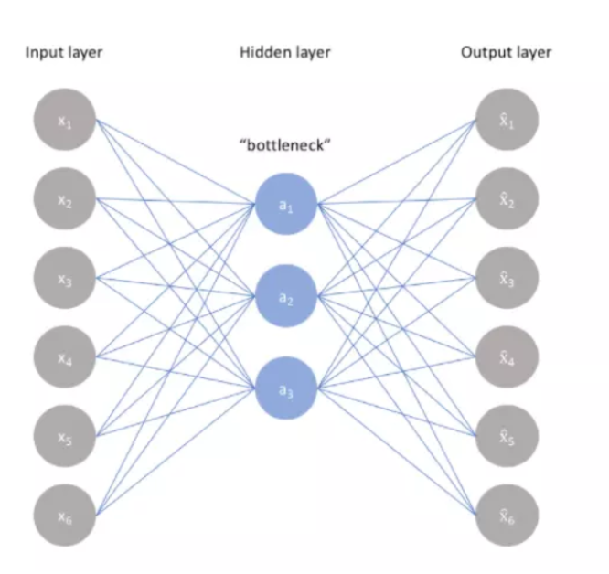
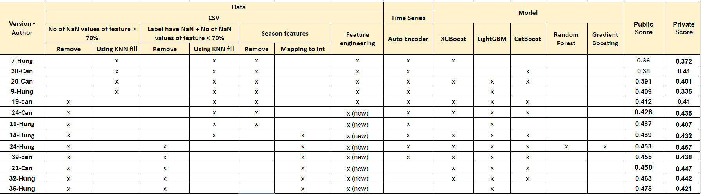
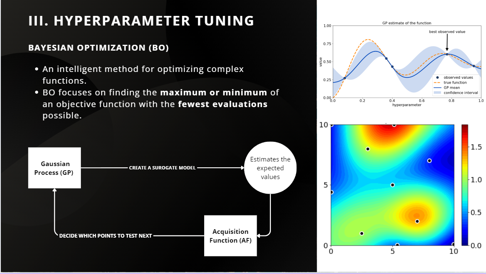
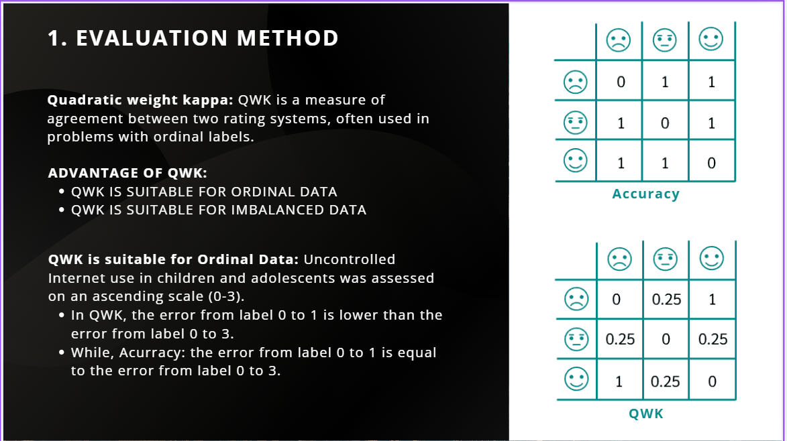
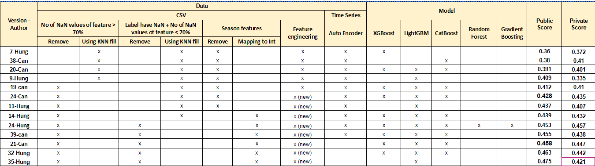

# Problematic-Internet-Use

## 1. Overview Problem

In today’s digital age, the uncontrolled use of the internet among children and adolescents is becoming a significant concern. This phenomenon not only affects mental health but is also closely linked to issues such as depression and anxiety. However, current methods for assessing unhealthy internet usage are often complex and require professional intervention. This inadvertently creates barriers in terms of accessibility, language, and culture for many families. As a result, instead of directly measuring it, this issue is often identified through negative impacts, such as a decline in mental health. On the other hand, indicators related to physical activity and fitness are much more accessible, not requiring deep intervention or specialized knowledge. Changes in physical habits, such as poor posture, irregular eating patterns, and reduced physical activity, are common signs in individuals who overuse technology. Based on this connection, we propose using simple and available fitness indicators as an alternative tool to detect early signs of uncontrolled internet usage in children and adolescents, especially in contexts where experts or appropriate assessment tools are unavailable.

## 2. Approach

This task aims to develop a predictive model capable of analyzing data related to the physical activity and habits of children and adolescents to identify early signs of unhealthy internet and technology usage. In this tabular data problem, we focus on using several decision-tree-based classification models such as XGBoost and LightGBM, in combination with the information provided in tabular form, to make the most accurate assessment of the internet usage patterns of the surveyed subjects. Additionally, during the research and evaluation process, we incorporate deep learning models such as AutoEncoder to enhance data analysis efficiency. The details will be outlined below, with two main sections: data processing and model training construction.

## 3 Processing Data

### 3.1 CSV

#### 3.1.1 Handle Missing Features

In this task, we decided to remove features with more than 70% missing values, and the results improved. Therefore, we can conclude that when a feature has too much missing data, the model cannot learn anything meaningful from it. Such features can be considered unimportant and have little to no impact on the final results.

#### 3.1.2 Handle Unlabeled Data (sii)

There are many data without label.
Here, we approached this issue in two ways:

- Inferring the missing labels
- Completely removing them

##### 3.1.2.1 Inferring Missing Labels

In this problem, we experimented with various methods and found that **KNNImputer** was the most suitable.

##### 3.1.2.2 Removing Unlabeled Data

#### 3.1.3 Handling Categorical Features - Season Feature

After filtering, we identified **10 features** in categorical (string) format.
We propose two approaches for handling these features:

- **Removal**: Remove all seasonal features from the dataset, reducing 10 features in total (Versions 1–15).
- **Encoding**: Handle missing season data by adding a new category, "Missing," and then encoding each category into integers from 0 to 4 (Versions 14–35).

#### 3.1.4 Feature Engineering

We performed feature engineering to enhance data analysis and prediction performance. By combining strongly correlated features, we eliminated redundant information and created more effective features. Comparing results between datasets before and after applying feature engineering showed a significant improvement in scores.

### 3.2 Time Series

This dataset was provided by HBN, where their volunteers were asked to wear an accelerometer for 30 consecutive days to measure various life-related metrics. All these metrics were recorded in a Parquet file, consisting of approximately 95 features.

#### 3.2.1 Autoencoder

We use AutoEncoder in this problem for dimensionality reduction and feature learning. With the Parquet file containing 996 data points and the total number of features potentially exceeding 150 when combined with the CSV file, this could create challenges for the model in distinguishing important from less significant features.

AutoEncoder compresses data into a latent space and reconstructs the original data, effectively extracting core features. Empirical results show that versions utilizing AutoEncoder outperform those relying solely on the original features, and the model also demonstrates improved performance in anomaly detection.

_Auto Encoder_

## 4 Models

### 4.1 Model selection

With the problem's objective defined, we structured our approach around building a model to evaluate the severity of internet usage among children, scored on the SII (Severity Impairment Index) scale. This is based on tabular data comprising various attributes as described above. Specifically:

- Input: A tabular dataset with multiple attributes related to children's physical health and daily habits.
- Output: A score on the SII scale (0, 1, 2, 3), corresponding to increasing levels of severity in internet usage.

Once the input and output were established, we decided to use **decision tree-based** models.

In this task, we used 5 models:

- **Random Forests**
- **LightGBM**
- **XGBoost**
- **CatBoost**
- **Gradient Boosting**

However, due to their different mechanisms, these models possess distinct advantages. For instance, Random Forest leverages parallel computation, making it faster and more stable, while boosting models allow for fine-tuning, enabling them to adapt better to specific problems. Hence, we decided to experiment with various scenarios, including:

- Using a single model: LightGBM, XGBoost, or CatBoost.
- Combining three models: LightGBM, XGBoost, and CatBoost using bagging techniques, supported by the votingregressor model. This tool aggregates predictions from each model and calculates the final prediction based on their weights: (insert formula).
- Combining five models: LightGBM, XGBoost, CatBoost, Gradient Boosting, and Random Forest. Similar to the three-model combination, this version combines all five models to provide a final prediction.

### 4.2 Hyper params

In this task, we use Bayesian Optimization (BO) – an intelligent method for optimizing complex functions, especially when the function lacks a clear expression or is very costly to evaluate. BO focuses on finding the maximum or minimum of an objective function with the fewest evaluations possible.

### 4.3 Training model

#### 4.3.1 Weighted Kappa score

In this task, we use Weighted Kappa score, a measure of agreement between two rating system.

### 4.3.2 Traning model

## Final Result

